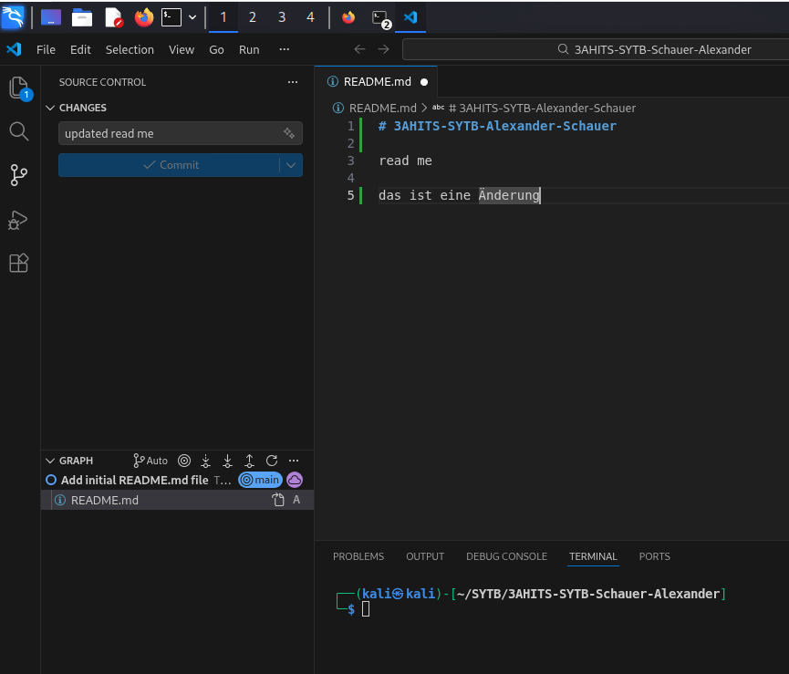
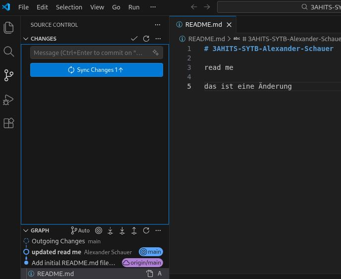

# Arbeitsbericht

- Datum: 3.3.2026
- Thema: Arbeitsbericht über Github Pages
- Name: Alexander Schauer
- Klasse: 3AHITS
- Fach: SYTB

# Übersicht

- Visual Studio Code downloaden
- Github repo anlegen und lokal laden
- Read me bearbeiten und pushen

# Visual Studio Code downloaden

auf https://code.visualstudio.com/ gehen und download for linux .deb drücken  
Nach download in Kali Konsole aufmachen und folgendes eingeben:
```
┌──(kali㉿kali)-[~]
└─$ cd Downloads 
┌──(kali㉿kali)-[~/Downloads]
└─$ ls              
code_1.109.5-1771531656_amd64.deb
┌──(kali㉿kali)-[~/Downloads]
└─$ sudo apt install ./code_1.109.5-1771531656_amd64.deb 
[sudo] password for kali: 
Note, selecting 'code' instead of './code_1.109.5-1771531656_amd64.deb'
Installing:
  code
 
Summary:
  Upgrading: 0, Installing: 1, Removing: 0, Not Upgrading: 0
  Download size: 0 B / 117 MB
  Space needed: 482 MB / 64.5 GB available
 
Get:1 /home/kali/Downloads/code_1.109.5-1771531656_amd64.deb code amd64 1.109.5-1771531656 [117 MB]
Preconfiguring packages ...
Selecting previously unselected package code.
(Reading database ... 391259 files and directories currently installed.)
Preparing to unpack .../code_1.109.5-1771531656_amd64.deb ...
Unpacking code (1.109.5-1771531656) ...
Setting up code (1.109.5-1771531656) ...
Processing triggers for shared-mime-info (2.4-4) ...
Processing triggers for mailcap (3.70+nmu1) ...
Processing triggers for desktop-file-utils (0.27-2) ...
Notice: Download is performed unsandboxed as root as file '/home/kali/Downloads/code_1.109.5-1771531656_amd64.deb' couldn't be accessed by user '_apt'. - pkgAcquire::Run (13: Permission denied)
```
jetzt ist vs code installiert

# Github repo anlegen und lokal laden

- auf https://github.com/ anmelden
- rechts oben auf Profilbild drücken
- repositories
- new
- name: 3AHITS-SYTB-Schauer-Alexander
- visibility: public

auf kali:
- Order erstellen und repo clonen
- mit code . Ordner in vscode öffnen

```
┌──(kali㉿kali)-[~]
└─$ setxkbmap de           
                                  
┌──(kali㉿kali)-[~]
└─$ mkdir SYTB                 
                                
┌──(kali㉿kali)-[~]
└─$ cd SYTB      
                                
┌──(kali㉿kali)-[~/SYTB]
└─$ git clone https://github.com/TajMadick/3AHITS-SYTB-Schauer-Alexander
Cloning into '3AHITS-SYTB-Schauer-Alexander'...
remote: Enumerating objects: 3, done.
remote: Counting objects: 100% (3/3), done.
remote: Total 3 (delta 0), reused 0 (delta 0), pack-reused 0 (from 0)
Receiving objects: 100% (3/3), done.
                             
┌──(kali㉿kali)-[~/SYTB]
└─$ ls              
3AHITS-SYTB-Schauer-Alexander                            

┌──(kali㉿kali)-[~/SYTB]
└─$ cd 3AHITS-SYTB-Schauer-Alexander                                                     

┌──(kali㉿kali)-[~/SYTB/3AHITS-SYTB-Schauer-Alexander]
└─$ ls
README.md

┌──(kali㉿kali)-[~/SYTB/3AHITS-SYTB-Schauer-Alexander]
└─$ code .  
```

# Read me bearbeiten und pushen

- davor muss man globale Variablen name und email setzten

```
┌──(kali㉿kali)-[~/SYTB/3AHITS-SYTB-Schauer-Alexander]
└─$ git config --global user.name "Alexander Schauer"

┌──(kali㉿kali)-[~/SYTB/3AHITS-SYTB-Schauer-Alexander]
└─$ git config --global user.email "alexander.schauer@htl-braunau.at"
```

- README bearbeiten oder erstellen falls nicht vorhanden
- auf 3. icon in der linken Leiste gehen (source control) und commit text eingeben
- das readme file speichern oder bei vs code autosave aktivieren

- commit drücken und dann sync changes

- jetzt ist die aktuelle Datei in Github