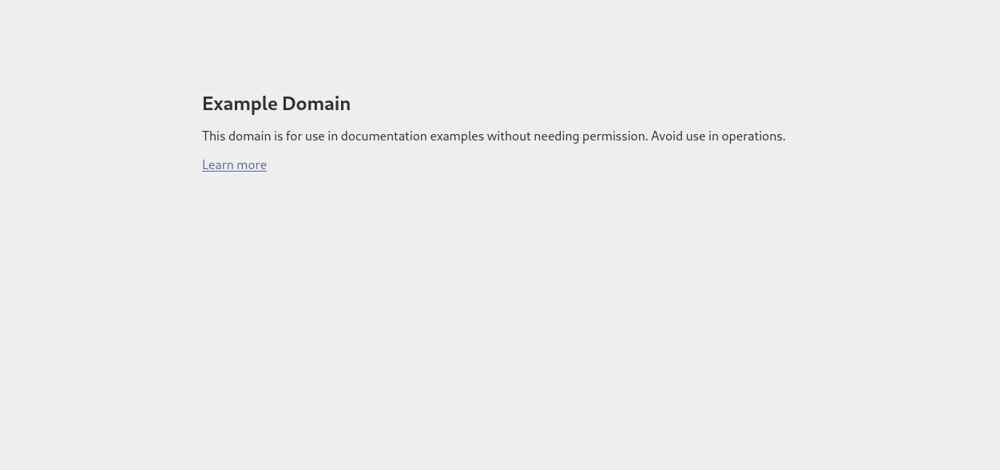

# Arbeitsbericht

- Datum: 10.3.2026
- Thema: Arbeitsbericht Curl
- Name: Alexander Schauer
- Klasse: 3AHITS
- Fach: SYTB

# Übersicht

- Zusammenfassung Curl
- Aufgaben
- Quellen

# Zusammenfassung Curl
- mit curl kann man in der Kommandozeile web-basierte Daten lesen und schreiben
- URL besteht aus Schema (https), Host (www.example.com), Pfad (/api/articles) und Query-String (?id=42&lang=de)
- die Query-Strings können dem Server gewisse Informationen über Authentifizierung oder angeforderte Daten geben, z.B. tokens oder welche Daten der Client möchte 
- der Client kann sich beim Request ein bestimmtes Datenformat wünschen (wenn der Server es unterstützt) z.B. JSON
- JSON (JavaScript Object Notation) ist das gängiste Format für API Requests (requests wo der Server etwas machen soll oder Daten übertragen werden sollen)

# Aufgaben

**Angabe:** Rufe die Startseite von example.com mit curl ab. Du siehst den HTML Code der Seite im Terminal. Vergleiche dazu die Ansicht im Web-Browser.

- In der Konsole curl www.example.com: macht eine einfache Abfrage (GET request)  

```
┌──(kali㉿kali)-[~/SYTB]
└─$ curl www.example.com                        
<!doctype html><html lang="en"><head><title>Example Domain</title><meta name="viewport" content="width=device-width, initial-scale=1"><style>body{background:#eee;width:60vw;margin:15vh auto;font-family:system-ui,sans-serif}h1{font-size:1.5em}div{opacity:0.8}a:link,a:visited{color:#348}</style></head><body><div><h1>Example Domain</h1><p>This domain is for use in documentation examples without needing permission. Avoid use in operations.</p><p><a href="https://iana.org/domains/example">Learn more</a></p></div></body></html>
```

Vergleich mit Browser Ansicht:


---

**Angabe:** Rufe dieselbe Seite wie in Aufgabe 1 auf, aber gib zusätzlich den HTTP-Response-Header aus. Hinweis: Es gibt dafür eine eigene curl-Option.  
Du siehst dann sogenannte Meta-Informationen, das sind Informationen über die Web-Site (z.B.date, content-type) und den Server – die aber vom Browser nicht angezeigt werden.

- mit curl -i www.example.com bekommt man zusätzliche Header Informationen  

manpage: 
> -i/--include
    (HTTP) Include the HTTP-header in the output. The HTTP-header includes things like server-name, date of the document, HTTP-version and more... 

```
┌──(kali㉿kali)-[~/SYTB]
└─$ curl -i www.example.com
HTTP/1.1 200 OK
Date: Tue, 10 Mar 2026 07:26:03 GMT
Content-Type: text/html
Transfer-Encoding: chunked
Connection: keep-alive
CF-RAY: 9da096c72b0d3261-VIE
Last-Modified: Thu, 05 Mar 2026 11:54:13 GMT
Allow: GET, HEAD
Accept-Ranges: bytes
Age: 9685
cf-cache-status: HIT
Server: cloudflare

<!doctype html><html lang="en"><head><title>Example Domain</title><meta name="viewport" content="width=device-width, initial-scale=1"><style>body{background:#eee;width:60vw;margin:15vh auto;font-family:system-ui,sans-serif}h1{font-size:1.5em}div{opacity:0.8}a:link,a:visited{color:#348}</style></head><body><div><h1>Example Domain</h1><p>This domain is for use in documentation examples without needing permission. Avoid use in operations.</p><p><a href="https://iana.org/domains/example">Learn more</a></p></div></body></html>
```
---
**Angabe:** Verbose Mode. Rufe eine beliebige URL auf und aktiviere den Verbose Mode, sodass Request, Response und Header sichtbar sind.

- Mit curl -v www.example.com aktiviert man den Verbose-Modus für zusätzliche Informationen

manpage:
> -v/--verbose
    Makes the fetching more verbose/talkative. Mostly useful for debugging. A line starting with '>' means "header data" sent by curl, '<' means "header data" received by curl that is hidden in normal cases, and a line starting with '*' means additional info provided by curl. 

```
┌──(kali㉿kali)-[~/SYTB]
└─$ curl -v www.example.com
* Host www.example.com:80 was resolved.
* IPv6: 2606:4700::6812:1a78, 2606:4700::6812:1b78
* IPv4: 104.18.27.120, 104.18.26.120
*   Trying 104.18.27.120:80...
* Connected to www.example.com (104.18.27.120) port 80
> GET / HTTP/1.1
> Host: www.example.com
> User-Agent: curl/8.7.1
> Accept: */*
> 
* Request completely sent off
< HTTP/1.1 200 OK
< Date: Tue, 10 Mar 2026 07:28:09 GMT
< Content-Type: text/html
< Transfer-Encoding: chunked
< Connection: keep-alive
< CF-RAY: 9da099d9caf8de3b-VIE
< Last-Modified: Thu, 05 Mar 2026 11:54:13 GMT
< Allow: GET, HEAD
< Accept-Ranges: bytes
< Age: 9811
< cf-cache-status: HIT
< Server: cloudflare
< 
<!doctype html><html lang="en"><head><title>Example Domain</title><meta name="viewport" content="width=device-width, initial-scale=1"><style>body{background:#eee;width:60vw;margin:15vh auto;font-family:system-ui,sans-serif}h1{font-size:1.5em}div{opacity:0.8}a:link,a:visited{color:#348}</style></head><body><div><h1>Example Domain</h1><p>This domain is for use in documentation examples without needing permission. Avoid use in operations.</p><p><a href="https://iana.org/domains/example">Learn more</a></p></div></body></html>
* Connection #0 to host www.example.com left intact
```
---
**Angabe:** Rufe diesen [Link](https://httpbin.org/status/404) mit curl auf, verwende die Option aus der vorangegangenen Aufgabenstellung. Recherchiere: Was bedeutet dieser http Status Code? Was zeigt ein Web-Browser bei Aufruf dieser URL an?

- curl im verbose mode auf url: https://httpbin.org/status/404

```
┌──(kali㉿kali)-[~/SYTB]
└─$ curl -v https://httpbin.org/status/404
* Host httpbin.org:443 was resolved.
* IPv6: (none)
* IPv4: 34.198.18.249, 34.230.126.118, 3.94.136.222, 18.235.222.110, 34.195.100.32, 34.199.144.244
*   Trying 34.198.18.249:443...
* Connected to httpbin.org (34.198.18.249) port 443
* ALPN: curl offers h2,http/1.1
* TLSv1.3 (OUT), TLS handshake, Client hello (1):
*  CAfile: /etc/ssl/certs/ca-certificates.crt
*  CApath: /etc/ssl/certs
* TLSv1.3 (IN), TLS handshake, Server hello (2):
* TLSv1.2 (IN), TLS handshake, Certificate (11):
* TLSv1.2 (IN), TLS handshake, Server key exchange (12):
* TLSv1.2 (IN), TLS handshake, Server finished (14):
* TLSv1.2 (OUT), TLS handshake, Client key exchange (16):
* TLSv1.2 (OUT), TLS change cipher, Change cipher spec (1):
* TLSv1.2 (OUT), TLS handshake, Finished (20):
* TLSv1.2 (IN), TLS handshake, Finished (20):
* SSL connection using TLSv1.2 / ECDHE-RSA-AES128-GCM-SHA256 / secp256r1 / rsaEncryption
* ALPN: server accepted h2
* Server certificate:
*  subject: CN=httpbin.org
*  start date: Jul 20 00:00:00 2025 GMT
*  expire date: Aug 17 23:59:59 2026 GMT
*  subjectAltName: host "httpbin.org" matched cert's "httpbin.org"
*  issuer: C=US; O=Amazon; CN=Amazon RSA 2048 M03
*  SSL certificate verify ok.
*   Certificate level 0: Public key type RSA (2048/112 Bits/secBits), signed using sha256WithRSAEncryption
*   Certificate level 1: Public key type RSA (2048/112 Bits/secBits), signed using sha256WithRSAEncryption
*   Certificate level 2: Public key type RSA (2048/112 Bits/secBits), signed using sha256WithRSAEncryption
* using HTTP/2
* [HTTP/2] [1] OPENED stream for https://httpbin.org/status/404
* [HTTP/2] [1] [:method: GET]
* [HTTP/2] [1] [:scheme: https]
* [HTTP/2] [1] [:authority: httpbin.org]
* [HTTP/2] [1] [:path: /status/404]
* [HTTP/2] [1] [user-agent: curl/8.7.1]
* [HTTP/2] [1] [accept: */*]
> GET /status/404 HTTP/2
> Host: httpbin.org
> User-Agent: curl/8.7.1
> Accept: */*
> 
* Request completely sent off
< HTTP/2 404 
< date: Tue, 10 Mar 2026 07:36:24 GMT
< content-type: text/html; charset=utf-8
< content-length: 0
< server: gunicorn/19.9.0
< access-control-allow-origin: *
< access-control-allow-credentials: true
< 
* Connection #0 to host httpbin.org left intact
```

- ```< HTTP/2 404```

Wikipedia: Statuscode 404:
> Die angeforderte Ressource wurde nicht gefunden. Dieser Statuscode kann ebenfalls verwendet werden, um eine Anfrage ohne näheren Grund abzuweisen.

---
**Angabe:** Geschlechtsschätzung anhand von Namen. Lade https://api.genderize.io mit curl → du bekommst eine Fehlermeldung. Ein Parameter wird an die URL so angefügt: ?name=value. Ermittle das wahrscheinliche Geschlecht von: Noor, Ariel, Amina, Elowen, Levin. Hinweis: verwende Quotes ("<URL>") in der curl Kommandozeile, da ? in der shell eine spezielle Bedeutung hat.
Das Datenformat, das hier vom Server gesendet wird, ist JSON. Ganz viele Web-APIs verwenden JSON. Verwende die Option zum Anzeigen des Response-Headers und suche darin nach einem Hinweis auf dieses Datenformat.

- mit ?name=value sagt man dem Server die gewünschten Daten

```
┌──(kali㉿kali)-[~/SYTB]
└─$ curl https://api.genderize.io         
{"error":"Missing 'name' parameter"}

┌──(kali㉿kali)-[~/SYTB]
└─$ curl "https://api.genderize.io?name=Noor"
{"count":167923,"name":"Noor","gender":"female","probability":0.61}

┌──(kali㉿kali)-[~/SYTB]
└─$ curl "https://api.genderize.io?name=Ariel"
{"count":74669,"name":"Ariel","gender":"male","probability":0.83}

┌──(kali㉿kali)-[~/SYTB]
└─$ curl "https://api.genderize.io?name=Amina"
{"count":198519,"name":"Amina","gender":"female","probability":0.96}

┌──(kali㉿kali)-[~/SYTB]
└─$ curl "https://api.genderize.io?name=Elowen"
{"count":23,"name":"Elowen","gender":"female","probability":0.87}

┌──(kali㉿kali)-[~/SYTB]
└─$ curl "https://api.genderize.io?name=Levin" 
{"count":3186,"name":"Levin","gender":"male","probability":0.96}     
```

```
┌──(kali㉿kali)-[~/SYTB]
└─$ curl -i "https://api.genderize.io?name=Elia"
HTTP/2 200 
server: nginx/1.16.1
date: Tue, 10 Mar 2026 07:58:39 GMT
content-type: application/json; charset=utf-8
content-length: 64
vary: accept-encoding
cache-control: max-age=0, private, must-revalidate
x-request-id: GJtr50ZpNdt7dweOODUC
access-control-allow-credentials: true
access-control-allow-origin: *
access-control-expose-headers: x-rate-limit-limit,x-rate-limit-remaining,x-rate-limit-reset
x-rate-limit-limit: 100
x-rate-limit-remaining: 28
x-rate-limit-reset: 57681

{"count":33253,"name":"Elia","gender":"male","probability":0.52}     
```

- in Zeile 4 der Response ```content-type: application/json; charset=utf-8``` steht, dass das Dateiformat (content-type): application/json ist

---
**Angabe:** In einer URL sind auch mehrere Parameter möglich – diese sind mit einem & getrennt:
?para1=value1&para2=value2.
Aufgabe: Unter dem API Endpoint https://api.open-meteo.com/v1/forecast gibt es Wetter Informationen. Die notwendigen Parameter sind latitude, longitude, und current_weather (Wetter-Beispiel). Verwende diese API um die aktuelle Wetterinformation für Braunau und für Funchal abzurufen.

- Auf https://www.gps-coordinates.net/ gehen und latitude und longitude für Braunau und Funchal suchen
- Braunau: 
- lat: 48.2534159
- long: 13.0397862
- Funchal:
- lat: 32.6496497
- long: -16.9086783

- als letzter Parameter noch current_weather=true

```
┌──(kali㉿kali)-[~/SYTB]
└─$ curl "https://api.open-meteo.com/v1/forecast/?latitude=48.2534159&longitude=13.0397862&current_weather=true"  
{"latitude":48.260002,"longitude":13.039999,"generationtime_ms":0.3122091293334961,"utc_offset_seconds":0,"timezone":"GMT","timezone_abbreviation":"GMT","elevation":353.0,"current_weather_units":{"time":"iso8601","interval":"seconds","temperature":"°C","windspeed":"km/h","winddirection":"°","is_day":"","weathercode":"wmo code"},"current_weather":{"time":"2026-03-10T08:00","interval":900,"temperature":1.7,"windspeed":0.4,"winddirection":270,"is_day":1,"weathercode":45}}

┌──(kali㉿kali)-[~/SYTB]
└─$ curl "https://api.open-meteo.com/v1/forecast/?latitude=32.6496497&longitude=-16.9086783&current_weather=true"
{"latitude":32.6875,"longitude":-16.875,"generationtime_ms":0.09179115295410156,"utc_offset_seconds":0,"timezone":"GMT","timezone_abbreviation":"GMT","elevation":32.0,"current_weather_units":{"time":"iso8601","interval":"seconds","temperature":"°C","windspeed":"km/h","winddirection":"°","is_day":"","weathercode":"wmo code"},"current_weather":{"time":"2026-03-10T08:00","interval":900,"temperature":13.4,"windspeed":13.0,"winddirection":19,"is_day":1,"weathercode":2}}                   
```

- man kann sehen in Braunau hat es 1.7 Grad und in Funchal 13.4

---
**Angabe:** JSON-Ausgaben sind kompakt und daher manchmal sehr schwer zu lesen. Pipe die Ausgabe von curl in das Tool jq, um zu formatieren.

- jq installieren: ```sudo wget https://github.com/stedolan/jq/releases/download/jq-1.6/jq-linux64 -O /usr/local/bin/jq``` (der command lädt jq direkt von der github page und speichert es in usr/local/binjq)

- mit ```curl "https://api.open-meteo.com/v1/forecast/?latitude=32.6496497&longitude=-16.9086783&current_weather=true" | jq``` den output in jq pipen


Formated Output:
```
┌──(kali㉿kali)-[~/SYTB]
└─$ curl "https://api.open-meteo.com/v1/forecast/?latitude=32.6496497&longitude=-16.9086783&current_weather=true" | jq
  % Total    % Received % Xferd  Average Speed   Time    Time     Time  Current
                                 Dload  Upload   Total   Spent    Left  Speed
100   469    0   469    0     0    223      0 --:--:--  0:00:02 --:--:--   223
{
  "latitude": 32.6875,
  "longitude": -16.875,
  "generationtime_ms": 271.9731330871582,
  "utc_offset_seconds": 0,
  "timezone": "GMT",
  "timezone_abbreviation": "GMT",
  "elevation": 32,
  "current_weather_units": {
    "time": "iso8601",
    "interval": "seconds",
    "temperature": "°C",
    "windspeed": "km/h",
    "winddirection": "°",
    "is_day": "",
    "weathercode": "wmo code"
  },
  "current_weather": {
    "time": "2026-03-10T08:15",
    "interval": 900,
    "temperature": 13.5,
    "windspeed": 13.4,
    "winddirection": 20,
    "is_day": 1,
    "weathercode": 2
  }
}
```
---
**Angabe:** Um welche Stadt handelt es sich im Wetter-Beispiel? Verwende den API Endpoint https://api-bdc.io/data/reverse-geocode-client um das herauszufinden.

```
┌──(kali㉿kali)-[~/SYTB]
└─$ curl "https://api-bdc.io/data/reverse-geocode-client"                                                             
{
  "latitude": 48.2599983215332,
  "lookupSource": "ip geolocation",
  "longitude": 13.039999961853027,
  "localityLanguageRequested": "en",
  "continent": "Europe",
  "continentCode": "EU",
  "countryName": "Austria",
  "countryCode": "AT",
  "principalSubdivision": "Oberosterreich",
  "principalSubdivisionCode": "AT-4",
  "city": "Braunau am Inn",
  "locality": "Braunau am Inn",
  "postcode": "",
  "plusCode": "8FWM725Q+XX",
  "localityInfo": {
    "administrative": [
      {
        "name": "Austria",
        "description": "country in Central Europe",
        "isoName": "Austria",
        "order": 4,
        "adminLevel": 2,
        "isoCode": "AT",
        "wikidataId": "Q40",
        "geonameId": 2782113
      },
      {
        "name": "Oberosterreich",
        "description": "federal state in the North of Austria",
        "isoName": "Oberosterreich",
        "order": 6,
        "adminLevel": 4,
        "isoCode": "AT-4",
        "wikidataId": "Q41967",
        "geonameId": 2769848
      },
      {
        "name": "Braunau District",
        "description": "district of Austria",
        "order": 9,
        "adminLevel": 6,
        "wikidataId": "Q255626",
        "geonameId": 2781519
      },
      {
        "name": "Braunau am Inn",
        "description": "town in Braunau District, Upper Austria, Austria",
        "order": 10,
        "adminLevel": 8,
        "wikidataId": "Q131128",
        "geonameId": 2781520
      }
    ],
    "informative": [
      {
        "name": "Europe",
        "description": "terrestrial continent located in north-western Eurasia",
        "isoName": "Europe",
        "order": 1,
        "isoCode": "EU",
        "wikidataId": "Q46",
        "geonameId": 6255148
      },
      {
        "name": "Europe/Berlin",
        "description": "time zone",
        "order": 2
      },
      {
        "name": "Europe/Vienna",
        "description": "time zone",
        "order": 3
      },
      {
        "name": "Western Austria",
        "order": 5,
        "wikidataId": "Q23241"
      },
      {
        "name": "Innviertel",
        "order": 7
      },
      {
        "name": "Innviertel",
        "description": "geographic region",
        "order": 8,
        "wikidataId": "Q700460",
        "geonameId": 2775213
      }
    ]
  }
}     
```

- bei der Stadt handelt es sich um Braunau am Inn

# Quellen
- https://linux.die.net/man/1/curl
- https://www.franzmatejka.at/htl/doc/ITSI_2_linux/13_curl.html
- https://dspyt.medium.com/installing-jq-to-parse-json-52b19b7e2a2c