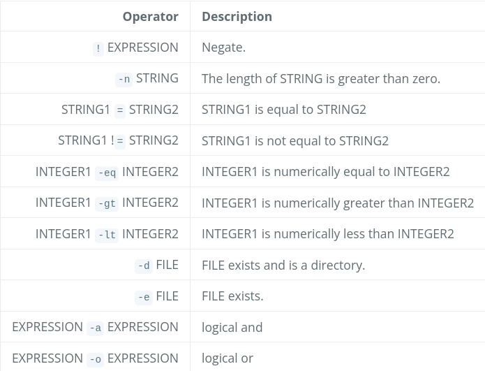

# Arbeitsbericht

- Datum: 28.4.2026
- Thema: [Exit Status und test Kommando](https://www.franzmatejka.at/htl/doc/SYTB_3/13_test_ue.html)
- Name: Alexander Schauer
- Klasse: 3AHITS
- Fach: SYTB

# Übersicht
  
- Übung (Datei zu groß)
- Übung (Dir Creator)
- Übung (Stundenplan)
- Übung (HTML Generator)
- Übung (C-Programm)


# Erklärung Exit Status und test Kommando

https://www.franzmatejka.at/htl/doc/SYTB_3/12_test.html

### Zusammenfassung Exit Status

- Exit Status gibt an die Shell zurück, ob das Programm erfolgreich gelaufen ist
- In der Shell ist jeder Code außer 0 ein Error im Gegensatz zu zB C wo jeder Code außer 0 **kein** Error ist
- Der exit Status ist in der Variable ```$?``` zu finden
- Um den Exit Status selbst zu setzen kann man: ```exit [Exitstatus]``` hernehmen 

### Zusammenfassung Test

- ```test``` ist die Grundlage für if-Anweisung in Scripts 

Syntax:

```bash
test 'xyz' = 'xyz'
echo $?
```

- andere Möglichkeit um test herzunehmen sind eckige Klammern

Syntax:

```bash
# Leerzeichen neben den [ ] !
[ 'xyz' = 'xyz' ]
echo $?
```

- eine Möglichkeit für bedingtes Ausführen sind ```&&``` und ```||``` rechts von ```test```
- Bei ```&&``` wird der Befehl rechts ausgeführt wenn test true (```$? = 0```)
- Bei ```||``` wird der Befehl rechts ausgeführt wenn test false (```$? != 0```)
  
Beispiel:

```bash
# 100 > 99:
test 100 -gt 99 && echo "Yes, that's true."

# Output: Yes, that's true.
```

Kombination von ```&&``` und ```||``` auch möglich:

```bash
test 100 -gt 99 && echo "Yes, that's true." || echo "No, that's false."

# Output: Yes, that's true.
```

### Operator Cheatsheet:



# Übung (Datei zu groß)

### Angabe:

Schreibe ein Skript mit einer Datei als Argument, es soll der Text Datei ist zu groß ausgegeben werden wenn die Datei mehr als 100 Bytes hat. Die Dateigröße kann mit ls -l und anschließendes cut ermittelt werden.

V1.1: Wenn die Datei nicht mehr als 100 Bytes hat soll der Text ```Größe OK``` ausgegeben werden.

### Lösung:

```bash
test $(ls -l $1 | cut -d " " -f5) -lt 100 && echo "Größe OK" || echo "Datei ist zu groß"
```

### Erklärung:

- mit ```ls -l $1``` bekommt man Informationen über die Datei die als erstes Argument übergeben wurde
- ```cut -d " " -f5``` setzt den delimiter auf Leerzeichen und nimmt die 5. Spalte
- dann mit test wenn der Output der Command Substitution kleiner als 100 dann wird durch ```Größe OK``` ausgegeben sonst ```Datei ist zu groß```

### Output:

```
┌──(kali㉿kali)-[~/SYTB/260428]
└─$ ./checkSize.sh checkSize.sh
Größe OK
                   
┌──(kali㉿kali)-[~/SYTB/260428]
└─$ ./checkSize.sh ../3AHITS-SYTB-Schauer-Alexander/260428/image.png
Datei ist zu groß
```


# Übung (Dir Creator)

### Angabe:

Schreibe ein Skript das den Namen eines Verzeichnisses übergeben bekommt. Das Verzeichnis soll angelegt werden wenn dieses noch nicht existiert. Wenn es das Verzeichnis schon gibt soll eine Warnung und der Inhalt des Verzeichnis angezeigt werden.

### Lösung:

```bash
# ! zum negaten
test ! -d $1 && mkdir $1 || echo "Verzeichnis existiert schon"; ls $1
```

### Erklärung:

- das ```;``` wird hergenommen, damit man mehrere Befehle nebeneinander schreiben kann
- zum output negaten schreibt mein ein ```!``` nach test

### Output:

```
┌──(kali㉿kali)-[~/SYTB/260428]
└─$ ./dirCreator.sh . 
Verzeichnis existiert schon
checkSize.sh  dirCreator.sh

┌──(kali㉿kali)-[~/SYTB/260428]
└─$ ./dirCreator.sh ./abc
    
┌──(kali㉿kali)-[~/SYTB/260428]
└─$ ls
abc  checkSize.sh  dirCreator.sh
```

# Übung (Stundenplan)

### Angabe:

Schreibe ein Bash Script das für den aktuellen Wochentag eine Kurzform des Stundenplans ausgibt:

```
$ ./splan.sh
Es ist Donnerstag
  AM SYTB SYTB frei MEDT MEDT BESP BESP
```

Hinweis: Mit ```date``` den aktuellen Wochentag ermitteln.

### Lösung:

```bash
tag=$(date +%u)

echo -n "Es ist "

test $tag = 1 && echo "Montag" && echo "GGP-w SEW SEW SEW ITP2MG frei INSY/ITSE INSY/ITSE"
test $tag = 2 && echo "Dienstag" && echo "SYTB SYTB ITP2PM E1 ITSE SYTB"
test $tag = 3 && echo "Mittwoch" && echo "D AM NWT1 NWT1 RK E1 frei SYTB GGP-w AM"
test $tag = 4 && echo "Donnerstag"&& echo "NW2-p AM SYTE ITP2PM BESP BESP"
test $tag = 5 && echo "Freitag" && echo "MEDT ITP2A RK ITSE MEDT/SYTE MEDT/SYTE"
test $tag = 6 && echo "Samstag" && echo "frei"
test $tag = 7 && echo "Sonntag" && echo "frei"
```

### Erklärung:

- ```date +%u``` gibt den Wochentag als Zahl von 1-7 zurück
- die ```-n``` option von echo macht nach echo keine Zeilenumbruch

### Output:

```
┌──(kali㉿kali)-[~/SYTB/260428]
└─$ ./stundenplan.sh   
Es ist Dienstag
SYTB SYTB ITP2PM E1 ITSE SYTB
```

# Übung (HTML Generator)

### Angabe:

Erstelle ein Skript das ein Markdown Dokument nach HTML konvertiert:

```$ ./md2html test.md test.html```

Verwende ```pandoc``` zum konvertieren.

Dabei soll aber nur dann konvertiert werden wenn dies wirklich **notwendig** ist, d.h. die html Zieldatei entweder nicht existiert oder älter ist als die Quelldatei, denn wenn sich die Quelldatei nicht geändert hat ist das konvertieren auch nicht notwendig.

### Lösung:

### Erklärung:

### Output:


# Übung (C-Programm)

### Angabe:

### Lösung:

### Erklärung:

### Output:
