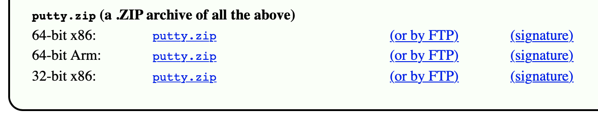
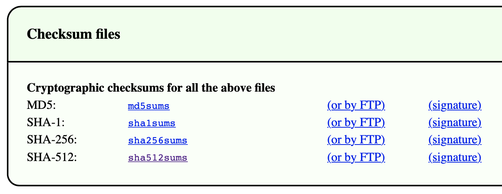

# Arbeitsbericht

- Datum: 12.5.2026
- Thema: [Download mit automatisierter Hash/Checksum Überprüfung](https://www.franzmatejka.at/htl/doc/SYTB_3/17_if_putty_ue.html)
- Name: Alexander Schauer
- Klasse: 3AHITS
- Fach: SYTB

# Übersicht

- Übung (Secure Download)
- Übung (Digitale Signatur prüfen)

# Übung (Maximum)

### Angabe:

PuTTY ist als SSH Client für Windows sehr beliebt. Genauso beliebt ist aber auch einen Trojaner in einem PuTTY Download zu verstecken. Um das zu verhindern werden Downloads gerne mit einem Hashwert (in diesem Zusammenhang auch **Checksum** genannt) abgesichert.

- Schreibe ein Script das einen Download der ```64-bit x86``` Variante von ```putty.zip``` durchführt. [Webseite von PuTTY](https://www.chiark.greenend.org.uk/~sgtatham/putty/latest.html).



- Gleichzeitig soll die Datei mit den SHA-512 checksums geladen werden. Diese sind ganz am Ende der Seite. Die passende Zeile im File ```sha512sums``` ist mit ```w64/putty.zip``` am Ende gekennzeichnet.



Im Script soll automatisiert geprüft werden ob die Checksum (=SHA-512 Hash) des geladenen Files mit der Checksum aus dem Checksumfile übereinstimmt. Also zum Beispiel eine Ausgabe kommen: ```HASH OK```.

- Das Script erwartet lediglich ```putty.zip``` im gleichen Directory
- Das checksum file soll das Script live von der PuTTY Seite laden und im ```/tmp``` Directory ablegen. Das Script erzeugt dafür mit ```mktemp``` ein Unterverzeichnis. Alle Zwischenergebnisse sollen ebenfalls in diesem temp directory abgelegt werden.

Eine Liste aller u.U. brauchbarer Tools:

- ```curl -O``` – zum Download
- ```grep``` – um die passende Zeile aus dem Checksum-File zu filtern
- ```cut``` – um den SHA-512 aus der Zeile zu extrahieren
- ```openssl``` – um den SHA-512 Hash von putty.zip zu rechnen
- ```xxd``` – ist nicht für das Script notwendig sondern fürs debugging der Zwischenergebnisse
- ```tr``` – ```tr -d [:space:]``` entfernt evtl. enthalten Leerzeichen und Zeilenumbrüche
- ```cmp``` – zum Vergleich der Hashwerte
- ```if``` – das Ergebnis von cmp auswerten


### Lösung:

```bash
if [ ! -f "putty.zip" ]
then
        curl -O -L "https://the.earth.li/~sgtatham/putty/latest/w64/putty.zip"
fi

tmpFolder=$(mktemp -d)
tmpDatei="${tmpFolder}/sha512sums"

curl -o $tmpDatei "https://the.earth.li/~sgtatham/putty/0.83/sha512sums"

tmpdownHash="${tmpFolder}/downloadedHash"
tmpcalcHash="${tmpFolder}/calulatedHash"

grep w64/putty.zip $tmpDatei | cut -d " " -f1 | tr -d [:space:] > $tmpdownHash
sha512sum putty.zip | cut -d " " -f1 | tr -d [:space:] > $tmpcalcHash

if cmp -s $tmpdownHash $tmpcalcHash
then
        echo "HASH OK"
else
        echo "HASH NOT OK"
fi
```

### Erklärung

- die erste ```if``` prüft ob im aktuellen Ordner ```putty.zip``` exisitiert
- wenn nicht wird die Datei mit ```curl``` runtergeladen 
- die ```-O``` flag heißt das man den Dateinamen vom Link einfach übernimmt
- die ```-L``` flag heißt das cURL redirects folgt, ansonsten kann es passieren das man eine Fehlerhafte ```.zip``` Datei lädt
- als nächstes wird ein neuer temporary Folder erstellt und der Name wird als Datei gespeichert
- danach wird ```curl```die dazugehörige Hash Datei geladen
- ```-o``` heißt hier das er das File mit eigenem Pfad und Dateinamen speichert
- danach wird in dieser Datei mit ```grep``` ```w64/putty.zip``` gesucht
- die Zeile wird in ```cut``` gepipped wo die erste Spalte (der Hashwert) herausgefilltert wird
- anschließend werden sicherheitshalber mit ```tr``` noch alle Leerzeichen entfernt
- das Ergebnis wird im ```/tmp``` folder als File gespeichert
- danach wird der SHA512 Hash der ```putty.zip``` Datei mit ```sha512sum``` berechnet
- hier wird ebenfalls nur die erste Spalte genommen und alle Leerzeichen entfernt
- anschließend kann man beide Dateien mit ```cmp``` vergleichen 
- die ```-s``` flag macht das er keine Fehlermeldung schmeißt wenn Hashes nicht gleich sind sondern einfach in das ```else``` geht

### Output:

```
┌──(kali㉿kali)-[~/SYTB/260512]
└─$ ./checkSum.sh   
  % Total    % Received % Xferd  Average Speed   Time    Time     Time  Current
                                 Dload  Upload   Total   Spent    Left  Speed
100   342  100   342    0     0   2265      0 --:--:-- --:--:-- --:--:--  2280
100 3998k  100 3998k    0     0  3325k      0  0:00:01  0:00:01 --:--:-- 5467k
  % Total    % Received % Xferd  Average Speed   Time    Time     Time  Current
                                 Dload  Upload   Total   Spent    Left  Speed
100 26626  100 26626    0     0   145k      0 --:--:-- --:--:-- --:--:--  146k
HASH OK

┌──(kali㉿kali)-[~/SYTB/260512]
└─$ ./checkSum.sh
  % Total    % Received % Xferd  Average Speed   Time    Time     Time  Current
                                 Dload  Upload   Total   Spent    Left  Speed
100 26626  100 26626    0     0   135k      0 --:--:-- --:--:-- --:--:--  135k
HASH OK
```
