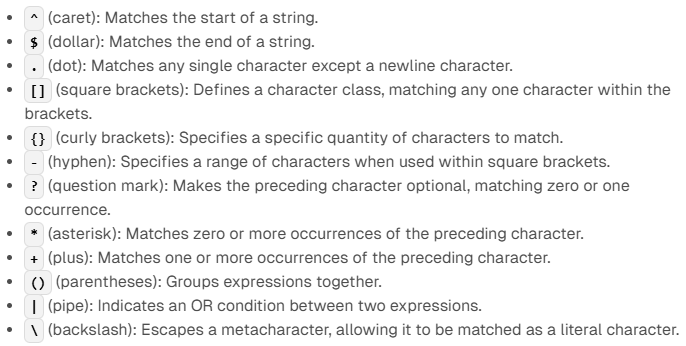

# Arbeitsbericht

- Datum: 2.6.2026
- Thema: [Regex](https://www.franzmatejka.at/htl/doc/SYTB_3/20_regex_ue.html)
- Name: Alexander Schauer
- Klasse: 3AHITS
- Fach: SYTB

# Übersicht

- Erklärung Regex
- Übung (Subdir Count)
- Übung (REs)
- Übung (sed)
- Übung (Datum)
- Übung (Logfile)

# Erklärung Regex

- Regex wird hergenommen nach gewissen Regeln nach Ausdrücken zu suchen oder Ausdrücke zu prüfen
- Ein Beispiel: wenn man einen nummerischen Ausdruck will sagt man [0-9]+ was so viel heißt wie: 1-unendlich Ziffern
- Erklärung verschiedener Regex Ausdrücke:
- ```.``` steht für einen Beliebigen Charakter
- genauso kann man zB. schreiben: ```a``` und dann muss ein ```a``` drinnen vorkommen
- mit ```*``` kann man sagen den vorgehenden Charakter 0-unendlich mal
- mit ```+``` kann man den vorhergehenden Charakter 1-unendlich mal
- ```\d``` steht für 0-9 und ```\w``` steht für A-Z, a-z und 0-9
- man kann mit [A-Za-z0-9] das gleiche bewirken wie mit ```\w``` also man kann die Ranges selber festlegen
- mit [^0-9] kann man alle Charaktere von 0-9 ausschließen
- wenn man Charaktere escapen will schreibt man ```\``` davor wie bei zB. ```\*```
- mit ```?``` nach dem Zeichen ist das Zeichen entweder 0 oder 1 mal
- Man kann auch conditionals machen also wenns entweder eins oder zwei sein soll schreibt man ```(eins|zwei)```
- Mit ```()``` kann man Syntaktische Gruppen bilden also wenn man schreib: ```(a?b+)``` kann man mit ```\1```  die erste Syntaktische Gruppe sehen
- mit ```^``` kann man den Start eines Strings makieren, mit ```$``` das Ende
- damit man diese Sachen hernehmen kann muss man bei ```sed``` und ```grep``` ```-E``` schreiben da viele der Sachen Expanded Regex Expressions sind

Zusammenfassung der wichtigsten Symbole:


# Übung (Subdir Count)

### Angabe:

Schreibe einen shell Einzeiler mit dem man die Anzahl der Unterverzeichnisse im aktuellen Verzeichnisse zählt.

Tipp: Directories haben in der ```ls -l``` Ausgabe ganz am Beginn ein ```d```.

### Lösung:

```bash
ls -l | grep ^d | wc -l
```

### Erklärung:

- ```ls -l``` mehr Infos aller Datein/Ordner im aktuellen Verzeichniss
- ```grep ^d``` sucht nach Strings die mit d Anfangen
- ```wc -l``` zählt die Zeilen

### Output:

```
┌──(kali㉿kali)-[~/SYTB/260609]
└─$ ./subdirCount.sh 
4
```

# Übung (REs)

### Angabe:

Finde 5 substantiell unterschiedliche Strings die durch folgende RE gematcht werden:

```^[a-zA-Z0-9_.+-]+@[a-zA-Z0-9-]+\.[a-zA-Z0-9.-]+$```

Verwende zum test [grep.js.org](https://grep.js.org/index.html)

Achtung: ERE daher ```-E``` Option notwendig.

### Lösung:

1. alexander.schauer@htl-braunau.at
2. -+fadfjo---@----faiodsfh.at
3. -+.-.-.@0123456789faiodsfh.--
4. max.muster_mann@gmail.com
5. max.@gmail.com

### Erklärung

- der Teil vor dem ```@``` direkt am Anfang können eine oder mehr Zeichen aus diesem Bereich sein ```[a-zA-Z0-9_.+-]``` 
- nach dem ```@``` und vor dem ```.``` sind Zeichen aus diesem Bereich ```[a-zA-Z0-9-]```
- Dann muss ein Punkt kommen ```\.``` da dieser mit Bachslash escaped ist
- vor dem Ende kommen ein oder mehr Zeichen aus dieser Range: ```[a-zA-Z0-9.-]```

# Übung (sed)

### Lösung:

Entferne alle ```#``` die sich am Ende der Zeile befinden:

```bash
echo "#abc #xyz#" | sed "s/^#//"
```

Entferne alle ```#``` die sich am Anfang der Zeile befinden

```bash 
echo "#abc #xyz#" | sed "s/#$//"
```

Füge ```===``` am Beginn jeder Zeile ein

```bash
echo "#abc #xyz#" | sed "s/^/===/"
```

Füge ```()``` rund um jedes Wort ein. Ein Wort ist definiert als mindestens ein nicht-Leerzeichen.

```bash
echo "#abc #xyz#" | sed -E "s/[^ ]+/(&)/g"
```

- das ```&``` ist der komplette gefundene Treffer
- das ```/g``` ersetzt alle Vorkommnisse in einer Zeile


# Übung (Datum)

### Angabe:

Mit sed. Datum re-formatieren von ```YYYY-MM-TT``` auf ```TT.MM.YYYY```. ```01/12/2020```-> ```12.01.2020```. Das Datum kann sich an beliebiger Position in der Zeile befinden.

### Lösung:

```bash
echo "01/12/2020" | sed -E 's#([0-9]{2})/([0-9]{2})/([0-9]{4})#\3/\2/\1#'
```

### Erklärung:

- ```#``` als Seperator hergenommen da man ```/``` für den Regex Teil braucht
- ```[0-9]{2}``` heißt das 2 Ziffern gesucht sind
- die Klammern Grenzen die Ausrücke in Gruppen ein
- mit ```\1``` bzw ```\2``` kann man auf die Gruppen zugreifen 

### Output:

```
2020/12/01
```


# Übung (Logfile)

### Angabe:

Lege eine Textdatei mit folgendem Inhalt an (Ausschnitt aus einem Logfile).

Aufgabenstellung:

- Verwende grep um nur jene Zeilen auszugeben die ```configure``` enthalten. Jene Zeilen die ```half-configured``` enthalten sollen nicht ausgegeben werden.
- Verwende grep um nur jene Zeilen auszugeben die ```libsombok``` oder ```libposix``` enthalten.
- Verwende sed um die Zeilen ohne die Uhrzeit auszugeben, d.h. ersetzte durch einen leeren String.
- Verwende sed um die Zeilen ohne das Datum auszugeben.
- Verwende sed um das Datum umzuformatieren von ```YYYY-MM-TT``` auf ```TT.MM.YYYY```. ```2021-01-16```-> ```16.01.2021```.

```
2021-01-16 23:38:01 status unpacked libarchive-zip-perl:all 1.60-1ubuntu0.1
2021-01-16 23:38:01 status half-configured libarchive-zip-perl:all 1.60-1ubuntu0.1
2021-01-16 23:38:01 status installed libarchive-zip-perl:all 1.60-1ubuntu0.1
2021-01-16 23:38:01 configure libmime-charset-perl:all 1.012.2-1 <none>
2021-01-16 23:38:01 status unpacked libmime-charset-perl:all 1.012.2-1
2021-01-16 23:38:01 status half-configured libmime-charset-perl:all 1.012.2-1
2021-01-16 23:38:01 status installed libmime-charset-perl:all 1.012.2-1
2021-01-16 23:38:01 configure libimage-exiftool-perl:all 10.80-1 <none>
2021-01-16 23:38:01 status unpacked libimage-exiftool-perl:all 10.80-1
2021-01-16 23:38:01 status half-configured libimage-exiftool-perl:all 10.80-1
2021-01-16 23:38:01 status installed libimage-exiftool-perl:all 10.80-1
2021-01-16 23:38:01 trigproc man-db:amd64 2.8.3-2 <none>
2021-01-16 23:38:01 status half-configured man-db:amd64 2.8.3-2
2021-01-16 23:38:21 status installed man-db:amd64 2.8.3-2
2021-01-16 23:38:21 configure libsombok3:amd64 2.4.0-1 <none>
2021-01-16 23:38:21 status unpacked libsombok3:amd64 2.4.0-1
2021-01-16 23:38:21 status half-configured libsombok3:amd64 2.4.0-1
2021-01-16 23:38:21 status installed libsombok3:amd64 2.4.0-1
2021-01-16 23:38:21 status triggers-pending libc-bin:amd64 2.27-3ubuntu1
2021-01-16 23:38:21 configure libposix-strptime-perl:amd64 0.13-1build3 <none>
2021-01-16 23:38:21 status unpacked libposix-strptime-perl:amd64 0.13-1build3
2021-01-16 23:38:21 status half-configured libposix-strptime-perl:amd64 0.13-1build3
2021-01-17 23:38:21 status installed libposix-strptime-perl:amd64 0.13-1build3
2021-01-17 23:38:21 configure libunicode-linebreak-perl:amd64 0.0.20160702-1build2 <none>
2021-01-17 23:38:21 status unpacked libunicode-linebreak-perl:amd64 0.0.20160702-1build2
2021-01-18 23:38:21 status half-configured libunicode-linebreak-perl:amd64 0.0.20160702-1build2
2021-01-20 23:38:21 status installed libunicode-linebreak-perl:amd64 0.0.20160702-1build2
2021-02-01 23:38:21 trigproc libc-bin:amd64 2.27-3ubuntu1 <none>
2021-03-03 23:38:21 status half-configured libc-bin:amd64 2.27-3ubuntu1
2021-03-04 23:38:23 status installed libc-bin:amd64 2.27-3ubuntu1
```

### Lösung:

Verwende grep um nur jene Zeilen auszugeben die ```configure``` enthalten. Jene Zeilen die ```half-configured``` enthalten sollen nicht ausgegeben werden.

```bash
┌──(kali㉿kali)-[~/SYTB/260609]
└─$ cat log.txt | grep " configure "
2021-01-16 23:38:01 configure libmime-charset-perl:all 1.012.2-1 <none>
2021-01-16 23:38:01 configure libimage-exiftool-perl:all 10.80-1 <none>
2021-01-16 23:38:21 configure libsombok3:amd64 2.4.0-1 <none>
2021-01-16 23:38:21 configure libposix-strptime-perl:amd64 0.13-1build3 <none>
2021-01-17 23:38:21 configure libunicode-linebreak-perl:amd64 0.0.20160702-1build2 <none>
```

Verwende grep um nur jene Zeilen auszugeben die ```libsombok``` oder ```libposix``` enthalten.

```bash
┌──(kali㉿kali)-[~/SYTB/260609]
└─$ cat log.txt | grep -E "(libsombok|libposix)"
2021-01-16 23:38:21 configure libsombok3:amd64 2.4.0-1 <none>
2021-01-16 23:38:21 status unpacked libsombok3:amd64 2.4.0-1
2021-01-16 23:38:21 status half-configured libsombok3:amd64 2.4.0-1
2021-01-16 23:38:21 status installed libsombok3:amd64 2.4.0-1
2021-01-16 23:38:21 configure libposix-strptime-perl:amd64 0.13-1build3 <none>
2021-01-16 23:38:21 status unpacked libposix-strptime-perl:amd64 0.13-1build3
2021-01-16 23:38:21 status half-configured libposix-strptime-perl:amd64 0.13-1build3
2021-01-17 23:38:21 status installed libposix-strptime-perl:amd64 0.13-1build3
```

Verwende sed um die Zeilen ohne die Uhrzeit auszugeben, d.h. ersetzte durch einen leeren String.

```bash
┌──(kali㉿kali)-[~/SYTB/260609]
└─$ cat log.txt | sed -E "s/[0-9]+:[0-9]+:[0-9]//" 
2021-01-16 1 status unpacked libarchive-zip-perl:all 1.60-1ubuntu0.1
2021-01-16 1 status half-configured libarchive-zip-perl:all 1.60-1ubuntu0.1
2021-01-16 1 status installed libarchive-zip-perl:all 1.60-1ubuntu0.1
2021-01-16 1 configure libmime-charset-perl:all 1.012.2-1 <none>
2021-01-16 1 status unpacked libmime-charset-perl:all 1.012.2-1
2021-01-16 1 status half-configured libmime-charset-perl:all 1.012.2-1
2021-01-16 1 status installed libmime-charset-perl:all 1.012.2-1
2021-01-16 1 configure libimage-exiftool-perl:all 10.80-1 <none>
2021-01-16 1 status unpacked libimage-exiftool-perl:all 10.80-1
2021-01-16 1 status half-configured libimage-exiftool-perl:all 10.80-1
2021-01-16 1 status installed libimage-exiftool-perl:all 10.80-1
2021-01-16 1 trigproc man-db:amd64 2.8.3-2 <none>
2021-01-16 1 status half-configured man-db:amd64 2.8.3-2
2021-01-16 1 status installed man-db:amd64 2.8.3-2
2021-01-16 1 configure libsombok3:amd64 2.4.0-1 <none>
2021-01-16 1 status unpacked libsombok3:amd64 2.4.0-1
2021-01-16 1 status half-configured libsombok3:amd64 2.4.0-1
2021-01-16 1 status installed libsombok3:amd64 2.4.0-1
2021-01-16 1 status triggers-pending libc-bin:amd64 2.27-3ubuntu1
2021-01-16 1 configure libposix-strptime-perl:amd64 0.13-1build3 <none>
2021-01-16 1 status unpacked libposix-strptime-perl:amd64 0.13-1build3
2021-01-16 1 status half-configured libposix-strptime-perl:amd64 0.13-1build3
2021-01-17 1 status installed libposix-strptime-perl:amd64 0.13-1build3
2021-01-17 1 configure libunicode-linebreak-perl:amd64 0.0.20160702-1build2 <none>
2021-01-17 1 status unpacked libunicode-linebreak-perl:amd64 0.0.20160702-1build2
2021-01-18 1 status half-configured libunicode-linebreak-perl:amd64 0.0.20160702-1build2
2021-01-20 1 status installed libunicode-linebreak-perl:amd64 0.0.20160702-1build2
2021-02-01 1 trigproc libc-bin:amd64 2.27-3ubuntu1 <none>
2021-03-03 1 status half-configured libc-bin:amd64 2.27-3ubuntu1
2021-03-04 3 status installed libc-bin:amd64 2.27-3ubuntu1
```

Verwende sed um die Zeilen ohne das Datum auszugeben.

```bash
┌──(kali㉿kali)-[~/SYTB/260609]
└─$ cat log.txt | sed -E "s/[0-9]{4}-[0-9]{2}-[0-9]{2} //"
23:38:01 status unpacked libarchive-zip-perl:all 1.60-1ubuntu0.1
23:38:01 status half-configured libarchive-zip-perl:all 1.60-1ubuntu0.1
23:38:01 status installed libarchive-zip-perl:all 1.60-1ubuntu0.1
23:38:01 configure libmime-charset-perl:all 1.012.2-1 <none>
23:38:01 status unpacked libmime-charset-perl:all 1.012.2-1
23:38:01 status half-configured libmime-charset-perl:all 1.012.2-1
23:38:01 status installed libmime-charset-perl:all 1.012.2-1
23:38:01 configure libimage-exiftool-perl:all 10.80-1 <none>
23:38:01 status unpacked libimage-exiftool-perl:all 10.80-1
23:38:01 status half-configured libimage-exiftool-perl:all 10.80-1
23:38:01 status installed libimage-exiftool-perl:all 10.80-1
23:38:01 trigproc man-db:amd64 2.8.3-2 <none>
23:38:01 status half-configured man-db:amd64 2.8.3-2
23:38:21 status installed man-db:amd64 2.8.3-2
23:38:21 configure libsombok3:amd64 2.4.0-1 <none>
23:38:21 status unpacked libsombok3:amd64 2.4.0-1
23:38:21 status half-configured libsombok3:amd64 2.4.0-1
23:38:21 status installed libsombok3:amd64 2.4.0-1
23:38:21 status triggers-pending libc-bin:amd64 2.27-3ubuntu1
23:38:21 configure libposix-strptime-perl:amd64 0.13-1build3 <none>
23:38:21 status unpacked libposix-strptime-perl:amd64 0.13-1build3
23:38:21 status half-configured libposix-strptime-perl:amd64 0.13-1build3
23:38:21 status installed libposix-strptime-perl:amd64 0.13-1build3
23:38:21 configure libunicode-linebreak-perl:amd64 0.0.20160702-1build2 <none>
23:38:21 status unpacked libunicode-linebreak-perl:amd64 0.0.20160702-1build2
23:38:21 status half-configured libunicode-linebreak-perl:amd64 0.0.20160702-1build2
23:38:21 status installed libunicode-linebreak-perl:amd64 0.0.20160702-1build2
23:38:21 trigproc libc-bin:amd64 2.27-3ubuntu1 <none>
23:38:21 status half-configured libc-bin:amd64 2.27-3ubuntu1
23:38:23 status installed libc-bin:amd64 2.27-3ubuntu1
```

Verwende sed um das Datum umzuformatieren von ```YYYY-MM-TT``` auf ```TT.MM.YYYY```. ```2021-01-16```-> ```16.01.2021```

```bash
┌──(kali㉿kali)-[~/SYTB/260609]
└─$ cat log.txt | sed -E 's#([0-9]{4})-([0-9]{2})-([0-9]{2})#\3.\2.\1#'
16.01.2021 23:38:01 status unpacked libarchive-zip-perl:all 1.60-1ubuntu0.1
16.01.2021 23:38:01 status half-configured libarchive-zip-perl:all 1.60-1ubuntu0.1
16.01.2021 23:38:01 status installed libarchive-zip-perl:all 1.60-1ubuntu0.1
16.01.2021 23:38:01 configure libmime-charset-perl:all 1.012.2-1 <none>
16.01.2021 23:38:01 status unpacked libmime-charset-perl:all 1.012.2-1
16.01.2021 23:38:01 status half-configured libmime-charset-perl:all 1.012.2-1
16.01.2021 23:38:01 status installed libmime-charset-perl:all 1.012.2-1
16.01.2021 23:38:01 configure libimage-exiftool-perl:all 10.80-1 <none>
16.01.2021 23:38:01 status unpacked libimage-exiftool-perl:all 10.80-1
16.01.2021 23:38:01 status half-configured libimage-exiftool-perl:all 10.80-1
16.01.2021 23:38:01 status installed libimage-exiftool-perl:all 10.80-1
16.01.2021 23:38:01 trigproc man-db:amd64 2.8.3-2 <none>
16.01.2021 23:38:01 status half-configured man-db:amd64 2.8.3-2
16.01.2021 23:38:21 status installed man-db:amd64 2.8.3-2
16.01.2021 23:38:21 configure libsombok3:amd64 2.4.0-1 <none>
16.01.2021 23:38:21 status unpacked libsombok3:amd64 2.4.0-1
16.01.2021 23:38:21 status half-configured libsombok3:amd64 2.4.0-1
16.01.2021 23:38:21 status installed libsombok3:amd64 2.4.0-1
16.01.2021 23:38:21 status triggers-pending libc-bin:amd64 2.27-3ubuntu1
16.01.2021 23:38:21 configure libposix-strptime-perl:amd64 0.13-1build3 <none>
16.01.2021 23:38:21 status unpacked libposix-strptime-perl:amd64 0.13-1build3
16.01.2021 23:38:21 status half-configured libposix-strptime-perl:amd64 0.13-1build3
17.01.2021 23:38:21 status installed libposix-strptime-perl:amd64 0.13-1build3
17.01.2021 23:38:21 configure libunicode-linebreak-perl:amd64 0.0.20160702-1build2 <none>
17.01.2021 23:38:21 status unpacked libunicode-linebreak-perl:amd64 0.0.20160702-1build2
18.01.2021 23:38:21 status half-configured libunicode-linebreak-perl:amd64 0.0.20160702-1build2
20.01.2021 23:38:21 status installed libunicode-linebreak-perl:amd64 0.0.20160702-1build2
01.02.2021 23:38:21 trigproc libc-bin:amd64 2.27-3ubuntu1 <none>
03.03.2021 23:38:21 status half-configured libc-bin:amd64 2.27-3ubuntu1
04.03.2021 23:38:23 status installed libc-bin:amd64 2.27-3ubuntu1
```